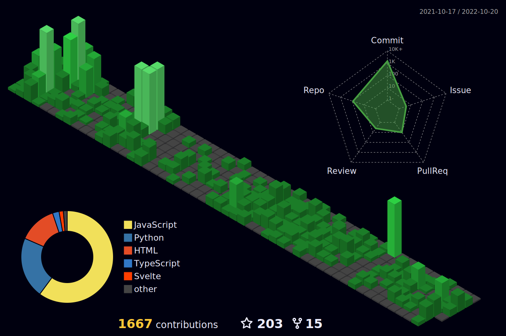
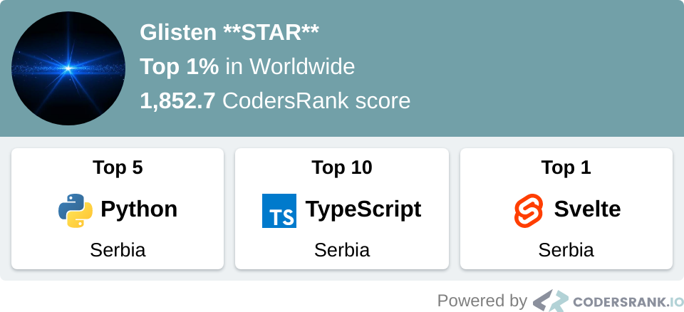

<!-- #: Senior Web and mobile developer. -->
<h1 style="font-size:64px" align="center">Inhale confidence, exhale doubt.</h1>
<h1 style="font-size:42px">🧐About me</h1>

<!-- #### :heart: I'm passionate about: -->
<!-- 
 -->

<table><tr><td valign="center" width="55%" style="border:1px solid red;">
I am a Senior web, mobile, and blockchain developer. I have 9+ years of experience writing web and mobile apps that span consumer productivity software to mission-critical financial trading platforms. I have extensive knowledge of front-end JavaScript and browser APIs and significant experience with popular frameworks and libraries like React & Svelte & Qwik. 

As a full-stack developer, my main programming languages are JS/TS, Rust, and Python. I have good experience with ❤️Svelte, React, Qwik❤️, Angular, and Vue. Particularly React, Svelte, and Qwik are my ❤️ frameworks and also I have rich experience with React Framework(MERN), and Svelte Framework(SvelteKit, Sapper).
Including the framework mentioned above, I have done 80 websites with MERN, SvelteKit, Vite, MEVN, Nuxt, Next, Laravel, and Django.

As a mobile developer, I have good experience with React Native and Flutter as hybrid apps.

I also have a strong technical understanding of various machine learning algorithms, including Neural networks Deep learning, and web automation using Python.

For web automation, I am working with JS Puppeteer and Python Selenium, I have achieved success in several projects using this technology.

</td>

<td valign="center" width="45%">
 

	
 	
	<!--  -->
	

 

</td></tr></table>  

<!-- (Most used languages by number of commits)

	

 -->

donate me: 0x35ce4eb3df9c56b9506b9439e50c7aa33b29a274 (bep-20 USDT)
<h1 style="font-size:42px">🤙Contact me</h1>
 
			  
<!-- [![image](https://img.shields.io/badge/Phone-D19936?style=for-the-badge&logo=data:image/svg%2bxml;base64,PHN2ZyByb2xlPSJpbWciIHZpZXdCb3g9IjAgMCAyNCAyNCIgeG1sbnM9Imh0dHA6Ly93d3cudzMub3JnLzIwMDAvc3ZnIj48dGl0bGU+R2l0SHViIFNwb25zb3JzIGljb248L3RpdGxlPjxwYXRoIGQ9Ik0xNy42MjUgMS40OTljLTIuMzIgMC00LjM1NCAxLjIwMy01LjYyNSAzLjAzLTEuMjcxLTEuODI3LTMuMzA1LTMuMDMtNS42MjUtMy4wM0MzLjEyOSAxLjQ5OSAwIDQuMjUzIDAgOC4yNDljMCA0LjI3NSAzLjA2OCA3Ljg0NyA1LjgyOCAxMC4yMjdhMzMuMTQgMzMuMTQgMCAwIDAgNS42MTYgMy44NzZsLjAyOC4wMTcuMDA4LjAwMy0uMDAxLjAwM2MuMTYzLjA4NS4zNDIuMTI2LjUyMS4xMjUuMTc5LjAwMS4zNTgtLjA0MS41MjEtLjEyNWwtLjAwMS0uMDAzLjAwOC0uMDAzLjAyOC0uMDE3YTMzLjE0IDMzLjE0IDAgMCAwIDUuNjE2LTMuODc2QzIwLjkzMiAxNi4wOTYgMjQgMTIuNTI0IDI0IDguMjQ5YzAtMy45OTYtMy4xMjktNi43NS02LjM3NS02Ljc1em0tLjkxOSAxNS4yNzVhMzAuNzY2IDMwLjc2NiAwIDAgMS00LjcwMyAzLjMxNmwtLjAwNC0uMDAyLS4wMDQuMDAyYTMwLjk1NSAzMC45NTUgMCAwIDEtNC43MDMtMy4zMTZjLTIuNjc3LTIuMzA3LTUuMDQ3LTUuMjk4LTUuMDQ3LTguNTIzIDAtMi43NTQgMi4xMjEtNC41IDQuMTI1LTQuNSAyLjA2IDAgMy45MTQgMS40NzkgNC41NDQgMy42ODQuMTQzLjQ5NS41OTYuNzk3IDEuMDg2Ljc5Ni40OS4wMDEuOTQzLS4zMDIgMS4wODUtLjc5Ni42My0yLjIwNSAyLjQ4NC0zLjY4NCA0LjU0NC0zLjY4NCAyLjAwNCAwIDQuMTI1IDEuNzQ2IDQuMTI1IDQuNSAwIDMuMjI1LTIuMzcgNi4yMTYtNS4wNDggOC41MjN6Ii8+PC9zdmc+&logoColor=white)](mailto:+17742769515) -->

  
<!--  --->
											   
											   
<!-- ## More in detail

	

 -->

	 
  													

<!-- <h1 align="center"></h1> -->
