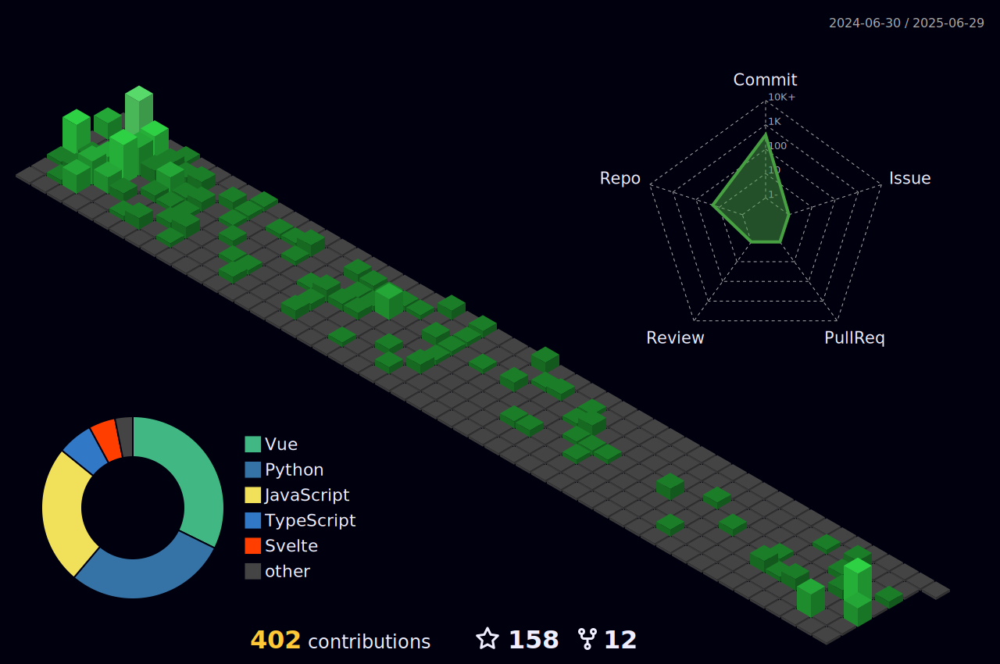

<!-- #: Senior Web and mobile developer. -->
<h1 style="font-size:64px" align="center">Inhale confidence, exhale doubt.</h1>
<h1 style="font-size:42px">🧐About me</h1>

<!-- #### :heart: I'm passionate about: -->
<!-- 
 -->

<table><tr><td valign="center" width="55%" style="border:1px solid red;">
With over 8 years of dedicated experience in web, mobile, and blockchain development, I've crafted a diverse website ranging from consumer productivity applications to sophisticated financial trading platforms, showcasing my adaptability and expertise across diverse sectors.  

As a seasoned full-stack developer proficient in JavaScript/TypeScript, PHP, Rust, and Python, I bring a comprehensive skill set to every project, seamlessly integrating cutting-edge technologies and frameworks such as React, Svelte, and Qwik to deliver innovative solutions tailored to each client's unique needs.

My passion lies in creating captivating user experiences, and I've honed my craft with a deep understanding of front-end JavaScript and browser APIs, coupled with extensive experience in frameworks like React, Svelte, and Qwik, which I consider not just tools but my creative companions in bringing ideas to life.

For my career, I've had the privilege of developing 80 websites using a variety of frameworks and platforms including MERN, SvelteKit, Vite, MEVN, Nuxt, Next, Laravel, and Django, each project a testament to my commitment to excellence and mastery of diverse tech stacks.

With a keen eye for mobile development, I've seamlessly navigated the realms of React Native and Flutter, crafting hybrid applications that combine the best of both worlds to deliver seamless user experiences across iOS and Android platforms.

Beyond traditional development paradigms, I've delved into the realm of machine learning, exploring intricate algorithms such as neural networks and deep learning to push the boundaries of what's possible in the digital landscape, all while leveraging Python to drive automation and efficiency in web processes through tools like Puppeteer and Selenium.

Whether it's architecting robust back-end systems or crafting pixel-perfect front-end designs, I thrive on the challenge of bringing ideas to fruition, leveraging my expertise across multiple disciplines to deliver solutions that not only meet but exceed expectations, leaving a lasting impact on users and stakeholders alike.

Let's collaborate and turn your vision into reality, making dreams come true one line of code at a time.

</td>

<td valign="center" width="45%">
 
	<h1 style="font-size:42px">😜 Glimpse</h1>

	
<!--  	 -->
	
	

 
 
<!-- <h1 style="font-size:42px">🍗Donate Me:</h1>
✔ 0x35ce4eb3df9c56b9506b9439e50c7aa33b29a274  
&emsp;&emsp;&emsp;&emsp;&emsp;&emsp;&emsp;&emsp;&emsp;&emsp;&emsp;&emsp;&emsp;&emsp;&emsp;(bep-20, erc-20 USDT) 
✔ TS3VYX4s7uP19YPfGsCgWsgiQBYNqTj2Ea  
&emsp;&emsp;&emsp;&emsp;&emsp;&emsp;&emsp;&emsp;&emsp;&emsp;&emsp;&emsp;&emsp;&emsp;&emsp;&emsp;&emsp;&emsp;(trc20 USDT)
  -->
</td></tr></table>  

<!-- (Most used languages by number of commits)

	

 -->

<h1 style="font-size:42px">🤙Contact me</h1>
 
			  
[![image](https://img.shields.io/badge/Phone-D19936?style=for-the-badge&logo=data:image/svg%2bxml;base64,PHN2ZyByb2xlPSJpbWciIHZpZXdCb3g9IjAgMCAyNCAyNCIgeG1sbnM9Imh0dHA6Ly93d3cudzMub3JnLzIwMDAvc3ZnIj48dGl0bGU+R2l0SHViIFNwb25zb3JzIGljb248L3RpdGxlPjxwYXRoIGQ9Ik0xNy42MjUgMS40OTljLTIuMzIgMC00LjM1NCAxLjIwMy01LjYyNSAzLjAzLTEuMjcxLTEuODI3LTMuMzA1LTMuMDMtNS42MjUtMy4wM0MzLjEyOSAxLjQ5OSAwIDQuMjUzIDAgOC4yNDljMCA0LjI3NSAzLjA2OCA3Ljg0NyA1LjgyOCAxMC4yMjdhMzMuMTQgMzMuMTQgMCAwIDAgNS42MTYgMy44NzZsLjAyOC4wMTcuMDA4LjAwMy0uMDAxLjAwM2MuMTYzLjA4NS4zNDIuMTI2LjUyMS4xMjUuMTc5LjAwMS4zNTgtLjA0MS41MjEtLjEyNWwtLjAwMS0uMDAzLjAwOC0uMDAzLjAyOC0uMDE3YTMzLjE0IDMzLjE0IDAgMCAwIDUuNjE2LTMuODc2QzIwLjkzMiAxNi4wOTYgMjQgMTIuNTI0IDI0IDguMjQ5YzAtMy45OTYtMy4xMjktNi43NS02LjM3NS02Ljc1em0tLjkxOSAxNS4yNzVhMzAuNzY2IDMwLjc2NiAwIDAgMS00LjcwMyAzLjMxNmwtLjAwNC0uMDAyLS4wMDQuMDAyYTMwLjk1NSAzMC45NTUgMCAwIDEtNC43MDMtMy4zMTZjLTIuNjc3LTIuMzA3LTUuMDQ3LTUuMjk4LTUuMDQ3LTguNTIzIDAtMi43NTQgMi4xMjEtNC41IDQuMTI1LTQuNSAyLjA2IDAgMy45MTQgMS40NzkgNC41NDQgMy42ODQuMTQzLjQ5NS41OTYuNzk3IDEuMDg2Ljc5Ni40OS4wMDEuOTQzLS4zMDIgMS4wODUtLjc5Ni42My0yLjIwNSAyLjQ4NC0zLjY4NCA0LjU0NC0zLjY4NCAyLjAwNCAwIDQuMTI1IDEuNzQ2IDQuMTI1IDQuNSAwIDMuMjI1LTIuMzcgNi4yMTYtNS4wNDggOC41MjN6Ii8+PC9zdmc+&logoColor=white)](mailto:+12002094753)

<!--  -->
 
<!--  --->
											   
											   
<!-- ## More in detail

	

 -->

	 
  													

<!-- <h1 align="center"></h1> -->
